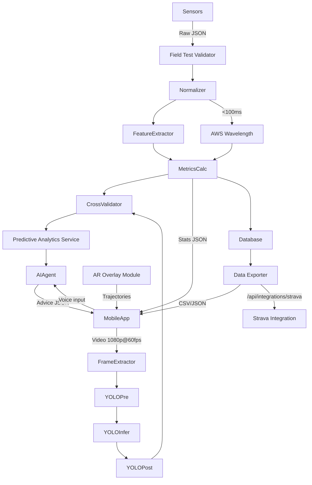

# Acey System High-Level Design

## System Architecture Diagram
```mermaid
flowchart TD
    subgraph MobileApplication[Mobile Application]
        UI[UI Layer (Next.js + Three.js)]
        AR[AR Module (ARKit/ARCore)]
        Video[Video Capture Module\n(H.264 1080p@60fps)]
        SensorCollector[Sensor Data Collector\n(BLE 5.2)]
        APIClient[API Client\n(REST + WebSocket)]
        Speech[Speech Interface\n(i18next en/es/fr)]
    end

    subgraph BackendServer[Backend Server]
        Gateway[API Gateway (Express)]
        Auth[Authentication Service\n(OAuth2 + JWT)]
        Processor[Data Processing Engine]
        Metrics[Metrics Calculator]
        Predict[Predictive Analytics Service]
        InferenceSvc[Model Inference Service]
        AIAgent[AI Agent Service]
        CrossVal[Cross-Validation Module]
        S3[Cloud Storage (S3)]
        StravaAPI[Strava/Apple Health]
    end

    subgraph Database
        Primary[Primary Instance]
        Replica[Read Replicas]
        TimeSeries[Time-Series Partition]
    end

    subgraph YOLO[YOLO v11 Model]
        Pre[Pre-processing]
        Infer[Inference]
        Post[Post-processing]
    end

    subgraph Sensors
        IMURacket[Racket IMU]
        IMUWrist[Wristband IMU]
        GPSBall[Ball GPS]
        SensorEco[Sensor Ecosystem Module]
        FieldTest[Field Testing\n(50g/100kmh)]
    end

    IMURacket -- "BLE 5.2\nJSON" --> SensorCollector
    IMUWrist -- "BLE 5.2\nJSON" --> SensorCollector
    GPSBall -- "BLE 5.2\nJSON" --> SensorCollector
    SensorEco -.-> SensorCollector
    SensorEco --> FieldTest

    Video -- "HTTPS POST /api/video\nH.264" --> Gateway
    SensorCollector -- "HTTPS POST /api/sensor\nJSON" --> Gateway
    APIClient <--> |"WebSocket\nJSON metrics"| Gateway
    Speech -- "Voice commands (en/es/fr)" --> APIClient

    Gateway --> Auth
    Gateway --> Processor
    Processor --> Metrics
    Processor --> Predict
    Processor --> InferenceSvc
    InferenceSvc --> Pre
    Pre --> Infer
    Infer --> Post
    Post --> InferenceSvc
    InferenceSvc --> CrossVal
    CrossVal -- "{ discrepancy: { speed: <3 km/h } }" --> Metrics
    Predict --> Gateway
    Metrics --> Gateway
    Metrics --> Database
    Gateway <--> S3
    Database <--> S3
    Database -->|"/api/export/stats?format=csv"| Gateway
    Gateway <--> |"/api/integrations/strava\nOAuth2"| StravaAPI
```

## Component Descriptions

### Mobile Application
- **Next.js 14.2+** with **TypeScript 5.2+**, **Three.js**, and an **AR Module** for overlays (render <500&nbsp;ms).
- Captures video at **1080p@60fps** via the Video Capture Module.
- Customizable dashboards with drag-and-drop widgets and live preview for stats.
- UX flow: user drags the shot speed widget onto the main screen and sees a live preview before saving the layout.
- Connects to sensors over **BLE 5.2** with target latency **<10&nbsp;ms**.
- Provides a Speech Interface with multi-language support (en, es, fr) via **i18next** and Web Speech API.
- Streams data to the Backend via HTTPS and WebSocket using the API Client, hitting endpoints such as `/api/match/realtime`.

### Backend Server
- **Node.js 20.12+** with **Express 4.19+** acting as the API Gateway. Early prototypes may run on **Firebase Functions** before migrating to ECS.
- **BullMQ** manages job queues for intensive tasks.
- Validates and normalizes sensor data, computes metrics (shot speed, spin), and checks YOLO results against sensor data (mismatch <5%).
- Runs a **Predictive Analytics Service** (scikit-learn) for opponent pattern prediction (e.g., "Predict next shot").
- Hosts the **AI Agent Service** (transformer-based model) to answer queries like "What errors did I make?" and caches results in **Redis 7.2+**.
- Provides integration endpoints such as `/api/integrations/strava` for Strava and Apple Health OAuth 2.0 token exchange.
- Stores raw videos in **AWS S3** and writes match data to the Database.

### Database
- **PostgreSQL 16.1+** with **TimescaleDB** for time-series data.
- Primary instance handles writes; read replicas serve analytics queries.
- Tables include `players`, `matches`, `shots`, and `trends` (player_id, metric, timeframe) with indexes on `timestamp` and `player_id` for queries <100&nbsp;ms.
- Expected growth: **2&nbsp;TB/year**.

### YOLO v11 Model
- **Python 3.11+** with **PyTorch 2.1+**, exported to **ONNX** for inference.
- Runs on **NVIDIA A100** GPUs with <1&nbsp;s per frame.
- Consumes tensors from the Backend, outputs JSON (bounding boxes, shot labels).
- Pre- and post-processing ensure consistent input size and validated labels.

### Sensors
- Placeholder IMU for racket/wristband and GPS for ball with a **Sensor Ecosystem Module** for physical integration.
- Requirements: IMU weight **<15g**, wristband rated **IP67**, impact-resistant GPS for the ball.
- Mounting uses adhesive for the racket and a strap for the wristband.
- Target specs: **BLE 5.2**, **48h battery**, **±0.1g** precision (IMU), **±1&nbsp;m** accuracy (GPS).
- Field testing must prove the IMU withstands **50g** vibrations and the GPS endures **100&nbsp;km/h** impacts.
- Measurement methods include using a calibrated accelerometer (e.g., ADXL345) to verify vibration levels and a high-speed camera to confirm ball impact speed.
- Emit JSON such as `{ "accel_x": 2.5, "gyro_z": 1.2, "lat": 40.7128, "timestamp": "2025-07-25T10:00:00Z" }`.

### AI Agent Service
- Transformer model (e.g., **Llama 3**) fine-tuned on tennis data.
- Supports open-ended queries such as "Compare my serve to Nadal's" and learns continuously from user feedback.
- Provides predictive analytics like "Predict opponent's next shot" based on historical patterns.
- Example query/response: `{ "query": "Predict opponent's next shot", "response": "Likely backhand based on 60% pattern" }`.
- Answers within **<200&nbsp;ms** and returns JSON `{ "response": "Increase topspin" }`.
- Accessible via REST and WebSocket through the Backend.

### Cloud Storage
- **AWS S3** stores raw videos (H.264 1080p@60fps) and processed analytics JSON.
- Lifecycle policy moves objects to Glacier after **90 days**.

## Data Flow Diagram


## Deployment Strategy
### Development
- Dockerized services running locally with a GPU-enabled container for YOLO and AI Agent.
- Backend prototypes deployed on **Firebase Functions/Firestore** for minimal cost.

### Testing
- Deployed to a cloud server with synthetic data and recorded videos to validate accuracy.

### Production
- **AWS ECS Fargate** hosts the Backend Server behind an **Application Load Balancer** with **WAF** once traffic grows.
- Initially, **AWS Lightsail** (~$100/month) can host the Backend to save costs.
- **Amazon RDS Aurora PostgreSQL** (multi-AZ) starts at **500&nbsp;GB**, with regular snapshots and S3 versioning for backups.
- Migration steps export Firestore to RDS via SQL scripts and reconfigure APIs for
  ECS deployment using Docker Compose. Example:
  ```sql
  EXPORT DATA WITH CSV OPTIONS();
  \copy shots FROM 'firestore_export/shots.csv' CSV;
  ```
- **Amazon SageMaker** runs YOLO v11 and AI Agent on **A100 GPUs** with <300&nbsp;ms inference latency; models pruned to **<50&nbsp;MB** for mobile inference.
- Videos and analytics stored in **Amazon S3** (versioned) and served via **CloudFront** (<100&nbsp;ms global access).
- Autoscaling triggers at **75% CPU/memory** utilization.
- End-to-end encryption via **TLS&nbsp;1.3**, **AWS KMS**, and user consent APIs for **GDPR/CCPA** compliance.
- Monitoring with **CloudWatch** (<200&nbsp;ms API latency) and **Sentry** for errors.
- Designed for **10,000 concurrent users**.

## Assumptions and Constraints
### Assumptions
- **1,000** initial users, scaling to **10,000** in 12 months.
- **200&nbsp;GB/month** video and **2&nbsp;TB/year** sensor data ingestion.
- Mobile devices support **BLE 5.2**, **6&nbsp;GB RAM**, **1080p@60fps** recording, and AR capability (**iOS 16+**, **Android 12+**).
- Sensors meet ±0.1g (IMU) and ±1&nbsp;m (GPS) accuracy.
- Multi-language voice commands (en, es, fr) supported via i18next.
- Prototyping uses **Firebase Functions/Firestore**.

### Constraints
- Initial budget **<\$10,000** (\$2,000 sensors, \$3,000 cloud, \$5,000 tools).
- Staged timeline: **Month 1-2** sensors, **Month 3-4** YOLO, **Month 5-6** AI/prototype.
- YOLO capped at <**100fps** without high-end GPUs.
- Sensor hardware not yet finalized; candidates from Bosch, STMicroelectronics, u-blox.

## Sensor Selection Research
- Compare IMUs like **Bosch BMI323** vs. **STMicroelectronics LSM6DSOX** for ±0.1g precision, power <50&nbsp;mW, and cost <\$200/unit.
- Evaluate GPS modules such as **u-blox NEO-7** for ±1&nbsp;m accuracy and BLE 5.2 support.
- Source components from vendors like DigiKey or Mouser, prioritizing 48-hour battery life and tennis durability.

## AI Agent Functionality
- Provides real-time analysis and voice-interactive feedback (e.g., "List my unforced errors").
- Utilizes a transformer model (Llama 3 or fine-tuned BERT) to generate strategic advice.
- Returns JSON responses such as `{ "response": "Reduce wrist angle for better topspin" }`.

## Historical Data Storage
- All videos and analytics saved to S3 for long-term retention.
- Database tables `user_history` and `match_stats` link to S3 objects for personalized queries like "Show my serve trends over 6 months".

## Error Handling and Recovery
- BLE retries use exponential backoff with 3 attempts.
- Failed processing jobs go to a dead-letter queue.
- Video streams reconnect automatically within **<5&nbsp;s**.

## Scalability and Performance
- Horizontal scaling via ECS tasks and Database read replicas.
- Redis caching and planned sharding keep API latency <200&nbsp;ms.
- 3D renders in the Mobile App targeted at <500&nbsp;ms.

## User Experience
- Follows **Material Design 3** with Tailwind CSS.
- Supports offline sensor data collection and voice-activated analytics during play.

## Testing and Validation
- Aim for **95%** unit test coverage.
- Integration tests for APIs and AI Agent executed via **GitHub Actions**.
- Field tests with professional players for usability feedback.

## Technology Stack
- **Next.js 14.2.0**, **Node.js 20.12.0**, **PostgreSQL 16.1**, **PyTorch 2.1.0**.
- AWS services: ECS Fargate, SageMaker, RDS Aurora, S3, CloudFront, CloudWatch, WAF.
- Justified for scalability, performance, and managed infrastructure.

## Datasets
- Use public tennis videos (e.g., from YouTube) with data augmentation (rotation, noise) for training YOLO and the AI agent.
- Collaborate with coaches to label datasets and continuously refine models.

## Cost-Optimized Strategy
- Start with **Firebase Functions/Firestore** (~$500/month) and **AWS Lightsail** (~$100/month) for affordable hosting.
- Enable S3 object versioning and plan migration to ECS/SageMaker by exporting Firestore to RDS snapshots.

## Sensor Ecosystem Design
- IMU options such as **MPU-6050** (~$10) weighing <15g and vibration-resistant.
- Wristband rated **IP67** with 48h battery life; impact-resistant GPS module <10g.
- Prototype mounting uses adhesive for rackets and a strap for wristbands.

## AI Agent Advanced Capabilities
- Handles open-ended queries and opponent prediction requests.
- Continuously learns from user feedback and interfaces with the Predictive Analytics Service.

## Advanced Historical Analytics
- Use **Chart.js** for graphs and **Three.js** for 3D heatmaps.
- Endpoint `/api/export/stats?format=csv` and optional Strava integration.

## Security and Privacy
- Display user consent pop-ups and blur faces in videos with YOLO.
- Perform quarterly audits to satisfy **GDPR/CCPA** requirements.

## Simplified Development Plan
- Prototype with Firebase and Docker for local YOLO simulation on CPU.
- Gradually migrate to ECS and SageMaker as the user base grows.

## Dataset Acquisition Plan
- **Weeks 1-4**: scrape licensed YouTube clips and secure agreements.
- Ethical consideration: obtain written consent from creators for at least 100 clips.
- **Weeks 5-8**: collaborate with coaches to label data in **LabelStudio**.
- **Weeks 9-12**: augment footage (rotation, noise) for robust models.

## Budget and Timeline Breakdown
- **$2,000** sensors, **$3,000** cloud, **$5,000** tools.
- **Month 1-2**: sensors prototype.
- **Month 3-4**: YOLO integration and dataset collection.
- **Month 5-6**: AI agent and functional prototype.
